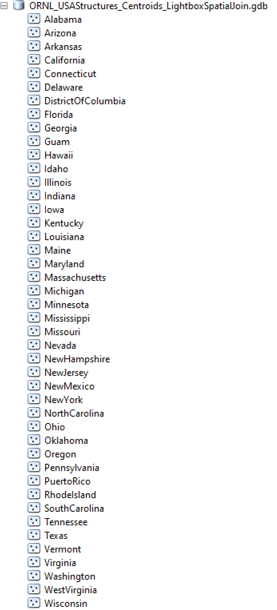

# EarthquakeDamageModel

**Methodology**
For more information about model methodology, review [this blog post on Medium](https://medium.com/new-light-technologies/a-predictive-earthquake-damage-model-written-in-python-e1862518fd92).

## Developer Setup
Set up a conda environment using the `requirements.txt` file.
Activate the conda environment before running any of the python commands below.
All commands in this README should be run inside of the following path:
`EarthquakeDamageModel/src`

## Data Downloads

This Python package contains 2 modules to download Census Tracts and Building Outlines (USA Structures) for the USA. These datasets are required for the model to run. You should run these commands once, to download the source data and extract them to the local DuckDB that will contain all data necessary for the model. You do not need to run these commands again unless you change the data source, or delete the database and need to recreate it. In which case, you can add the `--overwrite` flag to the commands below.

### Census Tracts
Source: https://www2.census.gov/geo/tiger/TIGER2024/TRACT/
To download, run:

```
python get_census_geos.py
```

You can add the flag `--overwrite` to overwrite the existing DuckDB table.

### USA Structures
Source: https://disasters.geoplatform.gov/USA_Structures/

To download, run:

```
python get_bldgs.py
```

You can add the flag `--overwrite` to overwrite the existing DuckDB table.


## Run the Earthquake Damage Model

Then, in terminal run the following initiate the Earthquake Model:
`python main.py`

The following args are available for use:




#### Building Centroids:
In order to estimate the number of structures impacted, the user will need to have a local geodatabase
containing building centroids for each state. Some open and public data sets that could be used are
[Microsoft Building Footprints](https://github.com/microsoft/USBuildingFootprints),
[OpenStreetMap](https://osmbuildings.org/) or
[ORNL USA Structures](http://disasters.geoplatform.gov/publicdata/Partners/ORNL/USA_Structures/).
The building centroids are used to calculate the count of structures within each Census Tract.
The file path of this geodatabase will need to be updated in `config.py` for the variable "BuildingCentroids".
(see image on right)


#### Testing Mode:
The model can be set up to run on a Task Scheduler and it will check for new earthquake events
using the [USGS ShakeMap API](https://earthquake.usgs.gov/fdsnws/event/1/) in order to estimate impacts in near-real time.
The model can be run in <i>testing mode</i> to demonstrate what the model outputs should look like.
To run the model in testing mode:
1. Unzip the shape.zip files inside the ShakeMaps_Testing subdirectories.
2. Change the function parameters in main.py "testing_mode" to be <b>True</b>.
3. Update file paths in `config.py` and uncomment lines 20/21 of `main.py` (depending on which test to run)
4. Follow the instructions below to set up the environment and run the program.


**References**
- Mike Hearne, USGS ["get-event.py"](https://gist.github.com/mhearne-usgs/6b040c0b423b7d03f4b9)
- [OpenQuake Platform](https://platform.openquake.org/) (for Hazus Damage Functions)
- [Hazus Earthquake Technical Manual](https://www.fema.gov/flood-maps/tools-resources/flood-map-products/hazus/user-technical-manuals#:~:text=Hazus%20Earthquake%20Manuals&text=The%20Hazus%20Earthquake%20User%20and,%2C%20scenario%2C%20or%20probabilistic%20earthquakes.)

**Contact**
Madeline Jones - madeline.jones.data.engineer@gmail.com
